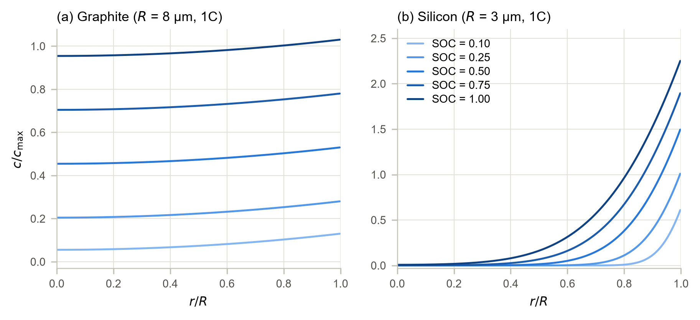
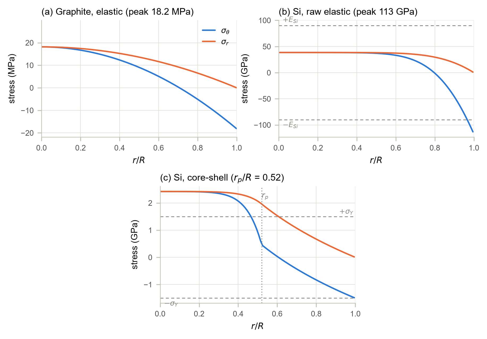
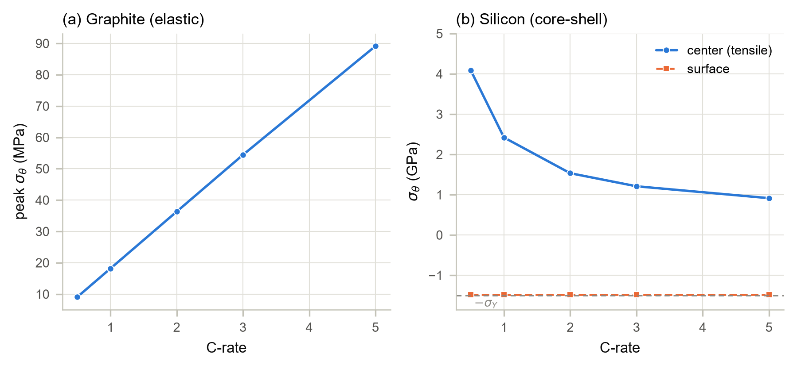
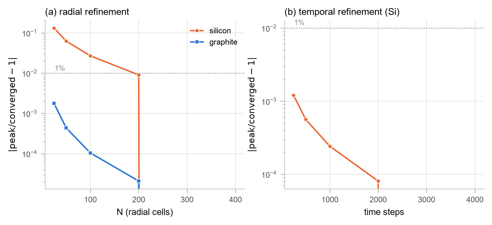
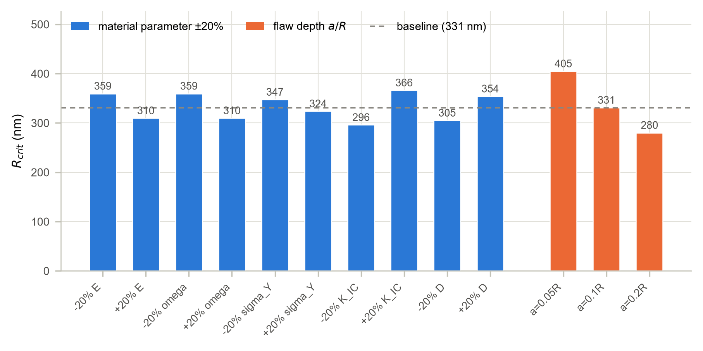

<div align="center">

# anode-dis-fracture

**Diffusion-induced stress & fracture screening in spherical lithium-ion battery anode particles**

*graphite (linear-elastic) vs silicon (elastic-plastic)*


Open-source Python (NumPy / SciPy / Matplotlib only) accompanying the conference
manuscript *"Stress-Driven Degradation of Li-Ion Battery Anodes"* (under review).
Every number and every figure in the paper is regenerated by two scripts in this repo.

</div>

## What this code does

Lithium entering an anode particle faster than it can spread out makes the swollen
outside fight the unswollen inside. That fight is **diffusion-induced stress (DIS)**.
If it beats the material's fracture resistance, the particle cracks. This code
predicts where that starts, for the two standard anode chemistries:

- **Graphite, the safe one.** Swelling is small (Ω·c<sub>max</sub> ≈ 8 %), so plain
  linear elasticity is valid. Peak stress ≈ 18 MPa of tension at the center during
  1C lithiation; critical radius **28 µm**, far above the commercial 5–15 µm → safe.
- **Silicon, the hard one.** Swelling is huge (Ω·c<sub>max</sub> ≈ 300 %) and the
  concentration gradient is nearly a step. The raw elastic solution predicts 113 GPa,
  above silicon's own stiffness (E = 90 GPa). That is the model flagging its own
  breakdown. An elastic-plastic (Tresca yield) core-shell correction restores
  consistency and moves the critical radius to **331 nm**, inside the
  experimentally observed 150–300 nm fragmentation window.

The pipeline mirrors the paper's method section, one module each:

```
materials.py            particle & material parameters (dataclass, SI units)
      │
      ▼
diffusion.py            lithium transport: implicit finite volumes, backward Euler,
      │                  constant (galvanostatic) surface flux
      ▼
christensen_newman.py   closed-form linear-elastic stress field (σr, σθ)
      │
      ▼
tresca.py               elastic-plastic correction: yielded shell + elastic core
      │
      ▼
fracture.py             Griffith flaw criterion → critical radius R_crit
```

## Quick start

```bash
pip install -r requirements.txt

python verification.py     # 25-check verification & regression suite
python generate_result.py  # regenerates all six figures (~1 min)
```

Both scripts run from the repository root. The `anode_dis` package is also
importable directly: `from anode_dis import GRAPHITE, SILICON, DiffusionSolver`.

## Verification

`verification.py` checks the code against everything it can be checked against,
with exit code 0/1 so it can run in CI. Two tiers:

- **Tier A, exact answers.** Manufactured solutions with known closed-form stress
  (uniform and linear concentration profiles), exact lithium mass balance (~1e-13),
  the analytic series solution for constant-flux diffusion, and continuity of the
  yield condition across the elastic-plastic boundary. This is the check that
  catches a wrong prefactor in the Tresca assembly.
- **Tier B, frozen benchmarks.** The paper's headline numbers with explicit
  tolerances, so silent behavioral drift shows up as a failure.

Current state: **25 / 25 checks pass.**

## Key results (1C, SOC = 0.5)

| | Graphite | Silicon |
|---|---|---|
| R, D | 8 µm, 3.9&times;10<sup>-14</sup> m<sup>2</sup>/s | 3 µm, 1.0&times;10<sup>-16</sup> m<sup>2</sup>/s |
| E, ν, σ<sub>Y</sub> | 15 GPa, 0.30, N/A (elastic) | 90 GPa, 0.22, 1.5 GPa |
| Eigenstrain Ω·c<sub>max</sub> | 0.084 (~8 %) | 3.00 (~300 %) |
| Raw elastic peak hoop | 18.2 MPa (center) | 113 GPa > E: small-strain breakdown |
| Corrected (Tresca) | N/A | r<sub>p</sub>/R = 0.52; center 2.42 GPa; surface −1.49 GPa |
| **Critical radius R<sub>crit</sub>** (a = 0.1R) | **28.1 µm** (commercial 5–15 µm → safe) | **331 nm** (experimental window 150–300 nm) |

C-rate sweep at SOC 0.5 (peak tensile hoop):

| C-rate | C/2 | 1C | 2C | 3C | 5C |
|---|---|---|---|---|---|
| Graphite (MPa) | 9.1 | 18.2 | 36.3 | 54.4 | 89.1 |
| Si center, corrected (GPa) | 4.08 | 2.42 | 1.53 | 1.21 | 0.91 |

Sensitivity of the silicon R<sub>crit</sub>: E, Ω, K<sub>IC</sub> at ±20 % → 296–366 nm;
σ<sub>Y</sub> → 324–347 nm; D → 305–354 nm; flaw depth a = 0.05–0.2R → 280–405 nm.
The result is robust: the correction, not parameter tuning, brings R<sub>crit</sub>
into the experimental window.

## Figures

All six figures are written by `generate_result.py` to `results/figures/`
(also committed as reproducibility evidence).

**1. Concentration profiles, why the two materials differ (1C)**

<p align="center">
  
</p>

*Graphite (left) stays nearly flat: lithium has time to spread. Silicon (right) is a
near-step, a thin lithiated shell over an empty core, because its diffusion
coefficient is ~400× smaller. That step is what makes silicon stress so extreme.*

**2. Stress profiles (1C, SOC = 0.5)**

<p align="center">
  
</p>

*(a) Graphite: the classic elastic picture, with a tensile core, compressive
surface, and peak 18 MPa. (b) Silicon, raw elastic: 113 GPa, beyond ±E (dashed
lines); the model is announcing it cannot be trusted here. (c) Silicon, corrected: a yielded shell
(r<sub>p</sub>/R = 0.52) around an elastic core; only the stress difference is pinned
at yield, so the core center can still reach +2.42 GPa in tension.*

**3. C-rate sweep (SOC = 0.5)**

<p align="center">
  
</p>

*Graphite (a) scales in step with the C-rate (9 → 89 MPa from C/2 to 5C). Silicon (b)
does the opposite: faster charging grows the yielded shell (r<sub>p</sub>/R from 0.36
to 0.77), which shields the core, so center tension drops from 4.1 to 0.9 GPa while
the surface stays pinned at −σ<sub>Y</sub>.*

**4. Griffith screening and critical radius (headline)**

<p align="center">
  
</p>

*Peak hoop stress meets the fracture strength σ<sub>f</sub>(R) at R<sub>crit</sub>;
the shaded region is fracture. Graphite: 28.1 µm, well above the commercial 5–15 µm
→ safe. Silicon: 331 nm, inside the experimentally observed 150–300 nm window.*

**5. Grid and time-step convergence**

<p align="center">
  
</p>

*Deviation of the peak stress from the finest grid / finest time step. Graphite
converges by N ≈ 100 cells. The silicon raw surface peak converges slowly (a
near-step gradient needs fine cells), so N = 400 is used for elastic diagnostics;
corrected results are yield-pinned and barely move, so N = 100 suffices there.*

**6. Sensitivity of the silicon R<sub>crit</sub>**

<p align="center">
  
</p>

*Every material parameter moved ±20 %, plus flaw depth a = 0.05–0.2R. R<sub>crit</sub>
stays within 280–405 nm throughout: the agreement with the 150–300 nm window comes
from the physics of the correction, not from parameter tuning.*

## How the model works

- **Diffusion.** The particle is divided into N concentric shells (finite volumes).
  Time stepping is backward Euler; the matrix never changes, so it is factorized
  once and reused. The surface boundary condition is a constant lithium flux
  (galvanostatic), and the global mass balance is exact to ~1e-13.
- **Elastic stress.** The Christensen-Newman closed-form solution: stress at radius
  r follows from one cumulative concentration integral I(r). The surface is
  traction-free by construction.
- **Plastic correction.** Where the elastic trial field violates the Tresca yield
  condition, a plastic shell grows inward from the surface
  (σ<sub>θ</sub> − σ<sub>r</sub> = ±σ<sub>Y</sub>). Its interface radius r<sub>p</sub>
  is found with a root finder (brentq), and the elastic core inside carries the
  shell's traction. Note what yield does and does not bound. Only the stress
  *difference* is limited; the hydrostatic tension at the core center can
  legitimately exceed σ<sub>Y</sub>.
- **Fracture.** Griffith surface-flaw strength σ<sub>f</sub> = K<sub>IC</sub> / √(aπR)
  with flaw depth a = 0.1R. R<sub>crit</sub> is where peak σ<sub>θ</sub>(R) =
  σ<sub>f</sub>(R), found by bracketing + brentq; the solver raises an error rather
  than returning silently when no crossover exists.

## Scope and limitations

Stated plainly (and in the paper):

- Material properties are constant (D, E, ν, Ω, K<sub>IC</sub>, σ<sub>Y</sub>), with
  no concentration dependence, and swelling is isotropic (no graphite anisotropy).
  The ±20 % sweep (Fig. 6) bounds the effect of these simplifications on the
  silicon R<sub>crit</sub> (296–366 nm).
- Constant-flux Fickian diffusion allows c<sub>surf</sub> > c<sub>max</sub>
  (no saturation); it is the gradient steepness, not the overshoot, that drives
  the stress.
- Small-strain theory throughout; the raw 113 GPa silicon number is reported as a
  *breakdown diagnostic*, not a physical stress.
- The Griffith criterion is a surface-flaw criterion, while during lithiation the
  peak *tension* sits at the particle center (the manuscript discusses the two
  fracture modes).
- The silicon raw surface peak converges slowly under grid refinement
  (113 → 116 GPa for N = 100 → 400); N = 400 is used for elastic diagnostics,
  N = 100 for corrected results where the peak is yield-pinned.

## Repository layout

```
anode_dis/                 the Python package (5 modules, see pipeline above)
verification.py            25-check verification & regression suite
generate_result.py         regenerates all paper figures
results/figures/           generated figures (committed as reproducibility evidence)
docs/references.md         bibliography of the accompanying manuscript
requirements.txt           pinned dependencies
```

## Citation

<!-- Replace with the published reference once available -->
> Author(s). *Stress-Driven Degradation of Li-Ion Battery Anodes.*
> Conference manuscript, under review (2026).

## License

MIT. See `LICENSE`.
