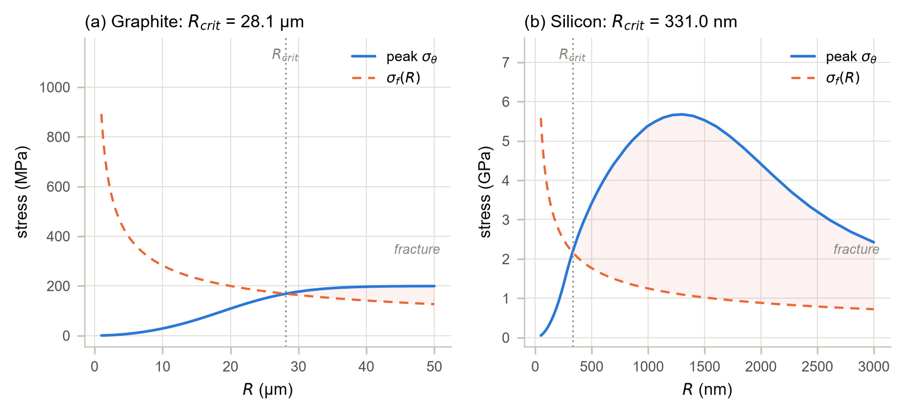

# anode-dis-fracture

**Diffusion-induced stress and fracture screening in spherical lithium-ion
battery anode particles: graphite (linear-elastic) vs silicon (elastic-plastic).**

Open-source Python implementation (NumPy / SciPy / Matplotlib only) accompanying
the conference manuscript *"Stress-Driven Degradation of Li-Ion Battery Anodes"*
(under review). Everything the paper reports, every number and every figure
is regenerated by two scripts in this repository.

---

## What this code does

Lithium entering an anode particle faster than it can spread out creates a
concentration gradient; the swollen outside and the unswollen inside fight each
other; that fight is **Diffusion-Induced Stress (DIS)**. If the stress beats the
material's fracture resistance, the particle cracks. This code predicts where
that starts, for the two canonical anode chemistries:

- **Graphite** : small eigenstrain (Ω·c<sub>max</sub> ≈ 8 %), linear elasticity is valid,
  ~18 MPa center tension during 1C lithiation, critical radius far above
  commercial particle sizes → **safe**.
- **Silicon** : Huge eigenstrain (Ω·c<sub>max</sub> ≈ 300 %) and near-step concentration
  gradients. The raw linear-elastic solution predicts 113 GPa; above the
  Young's modulus, i.e. internally inconsistent. An elastic-plastic (Tresca
  yield) core–shell correction restores consistency and moves the critical
  radius into the experimentally observed 150–300 nm fragmentation window.

The modeling pipeline mirrors the paper's method section, one module each:

```
materials.py            anode_materials parameters (dataclass, SI units)
      │
      ▼
diffusion.py            implicit finite-volume diffusion, backward Euler,
      │                 galvanostatic (constant flux) boundary condition
      ▼
christensen_newman.py   closed-form linear-elastic stress field (σr, σθ)
      │
      ▼
tresca.py               elastic-plastic core–shell correction
      │                 (surface shell at yield, elastic core)
      ▼
fracture.py             Griffith flaw criterion, critical radius R_crit
```

## Quick start

```bash
pip install -r requirements.txt

python verification.py     # 25-check verification & regression suite
python generate_result.py  # regenerates all six figures (~2 min)
```

Both scripts run from the repository root. The `anode_dis` package is also
importable directly: `from anode_dis import GRAPHITE, SILICON, DiffusionSolver`.

## Verification

`verification.py` is a two-tier suite (exit code 0/1, usable in CI):

- **Tier A Analytic / Internal consistency** (regression-proof): manufactured
  solutions for the closed-form stress (uniform and linear concentration
  profiles), exact mass balance under galvanostatic flux (~1e-13), radial
  profile shape against the analytic constant-flux series solution, and yield
  continuity at the elastic-plastic interface; the check that catches a wrong
  prefactor in the Tresca assembly.
- **Tier B frozen benchmarks**: the paper's headline numbers with explicit
  tolerances, so silent behavioral drift is caught.

Current state: **25 / 25 checks pass.**

## Key results (1C, SOC = 0.5)

| | Graphite | Silicon |
|---|---|---|
| R, D | 8 µm, 3.9&times;10<sup>-14</sup> m<sup>2</sup>/s| 3 µm, 1.0&times;10<sup>-16</sup> m²/s |
| E, ν, σ_Y | 15 GPa, 0.30, — (elastic) | 90 GPa, 0.22, 1.5 GPa |
| Eigenstrain Ω·c<sub>max</sub> | 0.084 (~8 %) | 3.00 (~300 %) |
| Raw elastic peak hoop | 18.2 MPa (center) | 113 GPa > E: small-strain breakdown |
| Corrected (Tresca) | n/a | r<sub>p</sub>/R = 0.52; center 2.42 GPa; surface −1.49 GPa |
| **Critical radius R_crit** (a = 0.1R) | **28.1 µm** (commercial 5–15 µm → safe) | **331 nm** (experimental window 150–300 nm) |

C-rate sweep at SOC 0.5 (peak tensile hoop):

| C-rate | C/2 | 1C | 2C | 3C | 5C |
|---|---|---|---|---|---|
| Graphite (MPa) | 9.1 | 18.2 | 36.3 | 54.4 | 89.1 |
| Si center, corrected (GPa) | 4.08 | 2.42 | 1.53 | 1.21 | 0.91 |

Sensitivity of the silicon R<sub>crit</sub>: E, Ω, K<sub>IC</sub> at ±20 % → 296–366 nm; σ<sub>Y</sub> →
324–347 nm; flaw depth a = 0.05–0.2R → 280–405 nm. The result is robust — the
correction, not parameter tuning, brings R<sub>crit</sub> into the experimental window.

## Figures

`generate_result.py` writes six figures to `results/figures/`:

1. Concentration profiles (graphite flat, silicon near-step)
2. Stress profiles — graphite elastic, silicon raw (breakdown), silicon corrected
3. C-rate sweep
4. **Griffith screening and critical radius** (headline figure)
5. Grid / time-step convergence
6. R<sub>crit</sub> sensitivity



## Model summary

- **Diffusion**: spherically symmetric Fickian diffusion, cell-centered finite
  volumes, backward Euler with a single LU factorization per run; galvanostatic
  Neumann flux at the surface, exact global mass balance.
- **Elastic stress**: Christensen–Newman closed-form solution expressed through
  the cumulative concentration integral I(r); traction-free surface by
  construction.
- **Plastic correction**: where the trial elastic field violates the Tresca
  condition at the surface, a plastic shell (σ<sub>θ</sub> − σ<sub>r</sub> = ±σ<sub>Y</sub>) is assembled on a
  brentq-solved interface radius r<sub>p</sub> around an elastic core that carries the
  shell's traction. Only the stress *difference* is bounded by yield — the
  hydrostatic part of the elastic core can legitimately exceed σ_Y in tension.
- **Fracture**: Griffith surface-flaw criterion σ<sub>f</sub> = K<sub>IC</sub> / $\sqrt{a\pi R}$ with flaw
  depth a = 0.1R; R_crit solves peak σ<sub>θ</sub>(R) = σ<sub>f</sub>(R) by bracketing + brentq.
  The solver raises rather than silently returning when no crossover exists.

## Scope and limitations

Stated honestly (and in the paper):

- Constant material properties: D, E, ν, Ω, K<sub>IC</sub> and the σ<sub>Y</sub> plateau are
  independent of concentration/state of charge, and swelling is isotropic
  (no graphite anisotropy). The ±20 % parameter sweep (fig. 6) bounds the
  effect of these simplifications on the silicon R<sub>crit</sub> (296–366 nm).
- Constant-flux Fickian diffusion allows c<sub>surf</sub> > c<sub>max</sub> (no saturation); it is
  the gradient steepness, not the overshoot, that drives the stress.
- Small-strain theory; the raw silicon result is reported as a *breakdown
  diagnostic*, not a physical stress.
- The Griffith criterion is a surface-flaw criterion; during lithiation the
  peak *tension* sits at the particle center (see manuscript for the fracture
  two-mode discussion).
- The silicon surface-peak converges slowly under grid refinement (113 →
  116 GPa for N = 100 → 400); N = 100 is used for corrected results where the
  peak is yield-pinned, N = 400 for elastic ones.

## Repository layout

```
anode_dis/                 the Python package (5 modules, see pipeline above)
verification.py            25-check verification & regression suite
generate_result.py         regenerates all paper figures
results/figures/           generated figures (committed as reproducibility evidence)
docs/references.md         bibliography of the accompanying manuscript
requirements.txt           pinned dependencies
```

## Citation

<!-- Replace with the published reference once available -->
> Author(s). *Stress-Driven Degradation of Li-Ion Battery Anodes.*
> Conference manuscript, under review (2026).

## License

MIT — see `LICENSE`.
